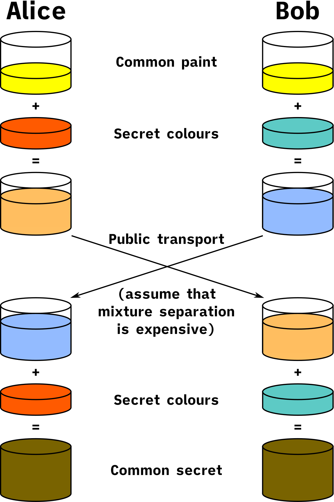

Diffie-Hellman was originally one of the earliest public-key protocols, and first later used as a symmetric-key protocol. Most secure connections established on a insecure network will benefit from using symmetric encryption rather than assymetric encryption, since the encryption and decipher algorithms are less complex and thereby require less computational power and will be executed faster. Hence asymmetric encryption algorithms like RSA is often used for encrypting private keys to establish a symmetric connection. 

The Diffie-Hellman algorithm is closely related to the discrete logarithm problem. which describes some concrete rules that makes it really inefficient to isolate a variable from an equation. Diffie-Hellman utilizes the discrete logarithm problem in it's key generation process to compute secrets which are able to be compromised consistently, but highly inefficient. Diffie-hellman is implemented over 2 algorithms, the modular exponential and the elliptic curve groups modulo algorithms. I will only address the (MODP) version. The algorithm is based on mathematical principles from multiple branches of pure mathematics ex. group theory, number theory, 

###Diffie-Hellman Illustration

######https://en.wikipedia.org/wiki/Diffie%E2%80%93Hellman_key_exchange#/media/File:Diffie-Hellman_Key_Exchange.svg

Above we can see an illustration how Diffie-Hellman works. To break it down into steps I would say it consists of 3 steps to generate a set of symmetric keys. To simplify the steps I will refer to the two parties performing a Diffie-Hellman as Alice and Bob. And I will use following variablenames throughout my explanations:

* a = Alice's secret pseudorandom number (Private key)
* b = Bob's secret pseudorandom number (Private key)
* x = arbitrary secret pseudorandom number (Private key)
* A = Alice's public key (Shared key)
* B = Bob's public key (Shared key)
* X = Arbitrary party's  public key (Shared key)
* p = the prime modulo  
* g = generator
* q = size of the subgroup of the integers modulo ``p``

##Agree on variables
To talk about the importance of the agreed variables, I think it is useful to give some context first. The equation used for generating the public keys are:
$$g^{x}\mod p\equiv X$$

This part is interesting, since it plays a crucial role in how difficult the keys should be to compromise. The public variables exposed to potential attackers are ``p`` and ``g``. The goal of ``p`` and ``g`` is to make sure the groups generated by the formula is safe. A strong group is defined by having the length of a large prime, which is to protect against some attacks that uses factorization in order to compromise the secret.

In reality you would probably use a prime and generator defined by industry standardized groups. There is a general concencus that a 2048 bit prime modulo should be the minimum size to achieve promising security. Luckily IKE (Internet Key Exchange) has published some groups. Taken the above into consideration, one could safely use their 14th group which uses a prime modulo of 2048 bit.

```
3.  2048-bit MODP Group

   This group is assigned id 14.

   This prime is: 2^2048 - 2^1984 - 1 + 2^64 * { [2^1918 pi] + 124476 }

   Its hexadecimal value is:

      FFFFFFFF FFFFFFFF C90FDAA2 2168C234 C4C6628B 80DC1CD1
      29024E08 8A67CC74 020BBEA6 3B139B22 514A0879 8E3404DD
      EF9519B3 CD3A431B 302B0A6D F25F1437 4FE1356D 6D51C245
      E485B576 625E7EC6 F44C42E9 A637ED6B 0BFF5CB6 F406B7ED
      EE386BFB 5A899FA5 AE9F2411 7C4B1FE6 49286651 ECE45B3D
      C2007CB8 A163BF05 98DA4836 1C55D39A 69163FA8 FD24CF5F
      83655D23 DCA3AD96 1C62F356 208552BB 9ED52907 7096966D
      670C354E 4ABC9804 F1746C08 CA18217C 32905E46 2E36CE3B
      E39E772C 180E8603 9B2783A2 EC07A28F B5C55DF0 6F4C52C9
      DE2BCBF6 95581718 3995497C EA956AE5 15D22618 98FA0510
      15728E5A 8AACAA68 FFFFFFFF FFFFFFFF

   The generator is: 2.
   ```
   https://tools.ietf.org/html/rfc3526#section-3

When p is a "safe prime", this means that $(p−1)/2$ is also prime. We then define $q=(p−1)2$. In that situation, the order of any non-zero $g\mod p$ (except 1 and p−1) is either q or 2q

>If h is a factor of the size of the group generated by g, then given $g^x\mod p$, we can compute $h\mod n$ in $O(\sqrt h)$ time. If g generates the entire group, well, its size will be $p−1$, which always has a factor of 2 (assuming $p>2$), and so we'd be giving away $x\mod 2$ for free.

https://crypto.stackexchange.com/questions/80938/diffie-hellman-what-is-the-subgroup/80939#80939

``p`` should be $p=2n+1$ where n also is a prime, which makes it a Sophie Germain Prime or a "safe prime", because some attacks relies on the factorizations an example could be the ``small subgroup attack`` where an eavesdropper intercepts the public key exchange and looks up for possible subgroups by searching through factors of $(p−1)$ and finds a small factor ``q`` and sends a public key with using the exponent generating the small subgroup hence the name of the attack.

Choosing the generator does not need as much thought as the prime modulo. When the prime is a Sophie Germain Prime, the order of any non-zero $g\mod p$  (except $1$ and $p−1$) subgroup will either be q or 2q, hence every g in $[2,p−2]$ ensures optimal security. Usually $g=2$ or $g=3$ is chosen as the generator.
  
To give an idea of the actual parameter sizes, typically used group and prime sizes are 160 bits for q and 1024 bits for p, or 256 bits for q and 2048 bits for p. 

## Create and exchange public keys

After the prime modulo and the generator has been agreed upon by the parties, they will generate a public key or shared value. I will use Alice and Bob as examples as the two parties. 

Alice will generate a secret key $a$ and $a\in[1,p-1]$ which she will use to generate her public key $A$ with $g^a \mod p \equiv A$ 

Bob will also generate a secret key $b$ and $b\in[1,p-1]$ which he will use to generate his public key $B$ with $g^b \mod p \equiv B$ 

they will transmit their generated public keys $A$ and $B$ to eachother. Now the eavesdropper is exposed to $A$, $B$, $g$ and $p$ but neither Alices nor bobs secret keys $a$ and $b$ been exposed over a public network.

## Generate symmetric keys

Using the 
$$pubK^{privK}\mod p \equiv asymkey$$
The discrete logarithm problem says that the equation above has no current solutions that can be solved faster than exponential relative to the size of a, without additional information.

If we want to solve for the exponent in a continous log, we can achieve by:

$$\begin{array}{cc}
a^{x}=&b\\
\:\:x=&\log_{a}b
\end{array}$$

However when we introduce the modulo in the equation, it suddenly becomes impossible to solve the equation without using functions. Really time consuming functions.

Confusion on prime sizes relative to secret number sizes. There is a general concensus that the prime used for Diffie-Hellman should be atleast 1024 bit, more preferably 2048 bit to be considered "safe". 

Why I think this is confusing
128 bit prime:
$$a=4386627406713377435825230798660911668$$
256 bit prime: 
$$b=84612854289522649808987883973782867615634280117273501953794963789129643590017$$

considering a however naive, but reasonable way to implement a Diffie-Hellman compromise would look as follows
$$a{1..n}\mod primitive−root=public−key$$

Picking prime with   p=2q+1 where q is also a prime protects against ``small subgroup confinement attack`` where 


NOTES:
the "result" of a modular equation is $\equiv$ congruent instead of equal. This is because the result divided by the modulo returns the same remainder as the congruent 

###Comprimising the symmetric keys 
Pollard Rho
Pohlig-Hellman
Small Subgroup Attacks# con-amore
